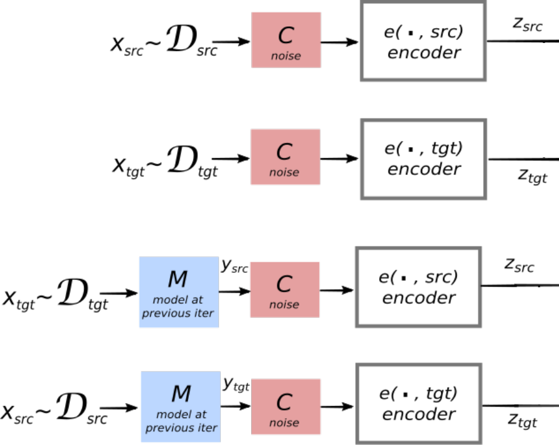
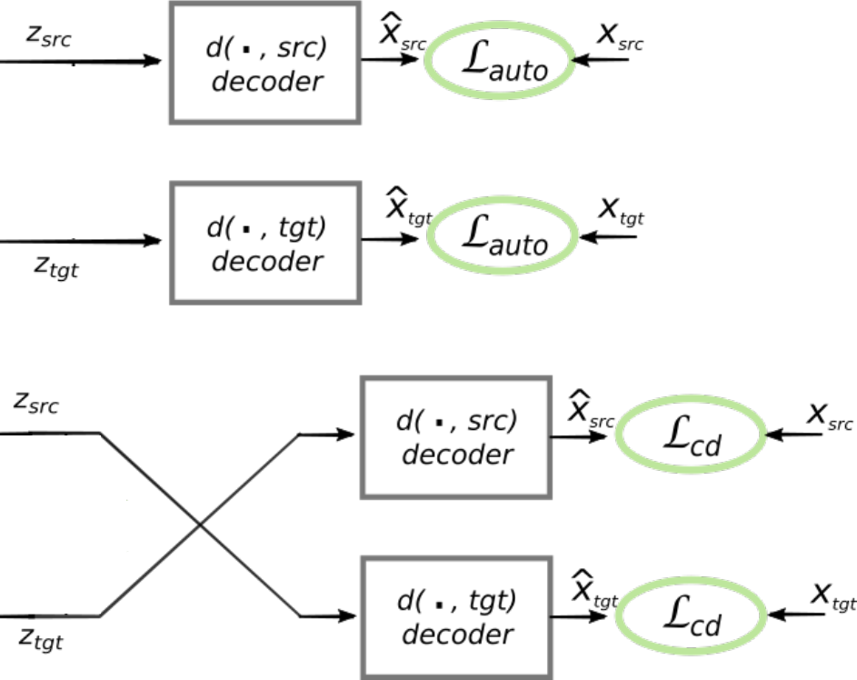
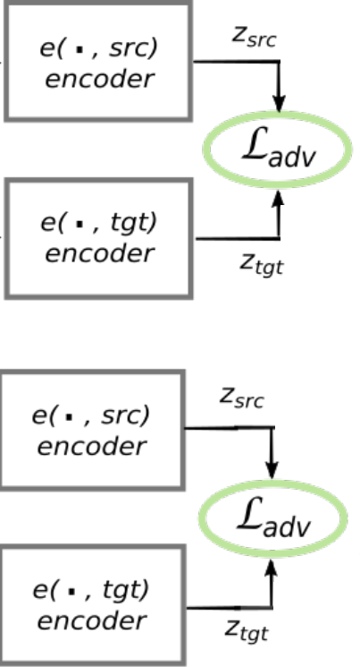

*Owner: Guillaume Klein (guillaume.klein (at) opennmt.net)*

# Unsupervised NMT with TensorFlow and OpenNMT-tf

We propose you to implement [*Unsupervised Machine Translation Using Monolingual Corpora Only*](https://arxiv.org/abs/1711.00043) (G. Lample et al. 2017) using [TensorFlow](https://www.tensorflow.org/) and [OpenNMT-tf](https://github.com/OpenNMT/OpenNMT-tf). While the project might take more than one day to complete, the goal of this session is to:

* dive into an interesting research paper applying adversarial training to NMT;
* learn about some TensorFlow mechanics;
* discover OpenNMT-tf concepts and APIs.

The guide is a step-by-step implementation with some functions left unimplemented for the curious reader. The completed code is available in the `ref/` directory.

## Requirements

* `git`
* `python`
* `virtualenv`

```bash
git clone --recursive https://github.com/OpenNMT/Hackathon.git
cd Hackathon/unsupervised-nmt
mkdir env
virtualenv env
source env/bin/activate
pip install -r requirements.txt
export PYTHONPATH=$PWD/OpenNMT-tf:$PYTHONPATH
```

## Data

The data are available at:

* [`unsupervised-nmt-enfr.tar.bz2`](https://s3.amazonaws.com/opennmt-trainingdata/unsupervised-nmt-enfr.tar.bz2) (2.2 GB)
* [`unsupervised-nmt-enfr-dev.tar.bz2`](https://s3.amazonaws.com/opennmt-trainingdata/unsupervised-nmt-enfr-dev.tar.bz2) (2.2 MB)

To get started, we recommend downloading the `dev` version which contains a small training set with 10K sentences.

Both packages contain the vocabulary files and a first translation of the training data using [an unsupervised word-by-word translation model](https://github.com/jsenellart/papers/tree/master/WordTranslationWithoutParallelData)\* as described in the paper. The full data additionally contains pretrained word embeddings using [fastText](https://github.com/facebookresearch/fastText).

\* also see the [MUSE](https://github.com/facebookresearch/MUSE) project that was recently released by Facebook Research team.

## Step-by-step tutorial

For this tutorial, the following resources might come handy:

* [TensorFlow documentation](https://www.tensorflow.org/api_docs/python/)
* [OpenNMT-tf documentation](http://opennmt.net/OpenNMT-tf/package/opennmt.html)
* [Numpy documentation](https://docs.scipy.org/doc/numpy/reference/index.html)

### Training

The training script `ref/training.py` implements one training iteration as described in the paper. Follow the next section to implement your own or understand the reference file.

#### Step 0: Base file

You can use this file to start implementing. It includes some common imports and a minimal command line argument parser:

```python
from __future__ import print_function

import argparse
import sys

import tensorflow as tf
import opennmt as onmt
import numpy as np

parser = argparse.ArgumentParser(formatter_class=argparse.ArgumentDefaultsHelpFormatter)
parser.add_argument("--model_dir", default="model",
                    help="Checkpoint directory.")
args = parser.parse_args()
```

#### Step 1: Reading the data

Loading text data in TensorFlow is made easy with the [`tf.data.Dataset`](https://www.tensorflow.org/api_docs/python/tf/data/Dataset) and the [`tf.contrib.lookup.index_table_from_file`](https://www.tensorflow.org/api_docs/python/tf/contrib/lookup/index_table_from_file) function. This code is provided so that we can ensure the data format used as input.

The required data are:

* the source and target monolingual datasets
* the source and target monolingual datasets translation from model `M(t-1)`
* the source and target vocabularies

Let's add the following command line options:

```python
parser.add_argument("--src", required=True,
                    help="Source file.")
parser.add_argument("--tgt", required=True,
                    help="Target file.")
parser.add_argument("--src_trans", required=True,
                    help="Source intermediate translation.")
parser.add_argument("--tgt_trans", required=True,
                    help="Target intermediate translation.")
parser.add_argument("--src_vocab", required=True,
                    help="Source vocabulary.")
parser.add_argument("--tgt_vocab", required=True,
                    help="Target vocabulary.")
```

and then create the training iterators:

```python
from opennmt import constants
from opennmt.utils.misc import count_lines

def load_vocab(vocab_file):
  """Returns a lookup table and the vocabulary size."""
  vocab_size = count_lines(vocab_file) + 1  # Add UNK.
  vocab = tf.contrib.lookup.index_table_from_file(
      vocab_file,
      vocab_size=vocab_size - 1,
      num_oov_buckets=1)
  return vocab, vocab_size

def load_data(input_file,
              translated_file,
              input_vocab,
              translated_vocab,
              batch_size=32,
              max_seq_len=50,
              num_buckets=5):
  """Returns an iterator over the training data."""

  def _make_dataset(text_file, vocab):
    dataset = tf.data.TextLineDataset(text_file)
    dataset = dataset.map(lambda x: tf.string_split([x]).values)  # Split on spaces.
    dataset = dataset.map(vocab.lookup)  # Lookup token in vocabulary.
    return dataset

  def _key_func(x):
    bucket_width = (max_seq_len + num_buckets - 1) // num_buckets
    bucket_id = x["length"] // bucket_width
    bucket_id = tf.minimum(bucket_id, num_buckets)
    return tf.to_int64(bucket_id)

  def _reduce_func(unused_key, dataset):
    return dataset.padded_batch(batch_size, {
        "ids": [None],
        "ids_in": [None],
        "ids_out": [None],
        "length": [],
        "trans_ids": [None],
        "trans_length": []})

  bos = tf.constant([constants.START_OF_SENTENCE_ID], dtype=tf.int64)
  eos = tf.constant([constants.END_OF_SENTENCE_ID], dtype=tf.int64)

  # Make a dataset from the input and translated file.
  input_dataset = _make_dataset(input_file, input_vocab)
  translated_dataset = _make_dataset(translated_file, translated_vocab)
  dataset = tf.data.Dataset.zip((input_dataset, translated_dataset))

  # Define the input format.
  dataset = dataset.map(lambda x, y: {
      "ids": x,
      "ids_in": tf.concat([bos, x], axis=0),
      "ids_out": tf.concat([x, eos], axis=0),
      "length": tf.shape(x)[0],
      "trans_ids": y,
      "trans_length": tf.shape(y)[0]})

  # Filter out invalid examples.
  dataset = dataset.filter(lambda x: tf.greater(x["length"], 0))

  # Batch the dataset using a bucketing strategy.
  dataset = dataset.apply(tf.contrib.data.group_by_window(
      _key_func,
      _reduce_func,
      window_size=batch_size))
  return dataset.make_initializable_iterator()

src_vocab, src_vocab_size = load_vocab(args.src_vocab)
tgt_vocab, tgt_vocab_size = load_vocab(args.tgt_vocab)

with tf.device("/cpu:0"):  # Input pipeline should always be place on the CPU.
  src_iterator = load_data(args.src, args.src_trans, src_vocab, tgt_vocab)
  tgt_iterator = load_data(args.tgt, args.tgt_trans, tgt_vocab, src_vocab)

src = src_iterator.get_next()
tgt = tgt_iterator.get_next()
```

You can test by printing the first example:

```python
with tf.Session() as sess:
  sess.run(tf.global_variables_initializer())
  sess.run(tf.tables_initializer())
  sess.run([src_iterator.initializer, tgt_iterator.initializer])
  print(sess.run(src))
```

*During development you can reuse this session creation code to print tensor values.*

#### Step 2: Noise model

This refers to the `C(x)` function described in the *Section 2.3* of the paper. As this function does not require backpropagation, we suggest to implement it in pure Python to make things easier:

```python
def add_noise_python(words, dropout=0.1, k=3):
  """Applies the noise model in input words.

  Args:
    words: A numpy vector of word ids.
    dropout: The probability to drop words.
    k: Maximum distance of the permutation.

  Returns:
    A noisy numpy vector of word ids.
  """
  # FIXME
  raise NotImplementedError()

def add_noise(ids, sequence_length):
  """Wraps add_noise_python for a batch of tensors."""

  def _add_noise_single(ids, sequence_length):
    noisy_ids = add_noise_python(ids[:sequence_length])
    noisy_sequence_length = len(noisy_ids)
    ids[:noisy_sequence_length] = noisy_ids
    ids[noisy_sequence_length:] = 0
    return ids, np.int32(noisy_sequence_length)

  noisy_ids, noisy_sequence_length = tf.map_fn(
      lambda x: tf.py_func(_add_noise_single, x, [ids.dtype, tf.int32]),
      [ids, sequence_length],
      dtype=[ids.dtype, tf.int32])

  noisy_ids.set_shape(ids.get_shape())
  noisy_sequence_length.set_shape(sequence_length.get_shape())

  return noisy_ids, noisy_sequence_length
```

The wrapper uses [`tf.py_func`](https://www.tensorflow.org/api_docs/python/tf/py_func) to include a Python function in the computation graph, and [`tf.map_fn`](https://www.tensorflow.org/api_docs/python/tf/map_fn) to apply the noise model on each sequence in the batch.

#### Step 3: Creating embeddings

The paper uses pretrained embeddings to initialize the embeddings of the model. Pretrained emnbeddings are included in the full data package (see above) and can be easily loaded with the [`load_pretrained_embeddings`](http://opennmt.net/OpenNMT-tf/package/opennmt.inputters.text_inputter.html#opennmt.inputters.text_inputter.load_pretrained_embeddings) function from OpenNMT-tf.

First you should add new command line arguments to accept pretrained word embeddings:

```python
parser.add_argument("--src_emb", default=None,
                    help="Source embedding.")
parser.add_argument("--tgt_emb", default=None,
                    help="Target embdding.")
```

Then, here is the code to load or create the embedding [`tf.Variable`](https://www.tensorflow.org/api_docs/python/tf/Variable):

```python
from opennmt.inputters.text_inputter import load_pretrained_embeddings

def create_embeddings(vocab_size, depth=300):
  """Creates an embedding variable."""
  return tf.get_variable("embedding", shape=[vocab_size, depth])

def load_embeddings(embedding_file, vocab_file):
  """Loads an embedding variable or embeddings file."""
  try:
    embeddings = tf.get_variable("embedding")
  except ValueError:
    pretrained = load_pretrained_embeddings(
        embedding_file,
        vocab_file,
        num_oov_buckets=1,
        with_header=True,
        case_insensitive_embeddings=True)
    embeddings = tf.get_variable(
        "embedding",
        shape=None,
        trainable=False,
        initializer=tf.constant(pretrained.astype(np.float32)))
  return embeddings

with tf.variable_scope("src"):
  if args.src_emb is not None:
    src_emb = load_embeddings(args.src_emb, args.src_vocab)
  else:
    src_emb = create_embeddings(src_vocab_size)

with tf.variable_scope("tgt"):
  if args.tgt_emb is not None:
    tgt_emb = load_embeddings(args.tgt_emb, args.tgt_vocab)
  else:
    tgt_emb = create_embeddings(tgt_vocab_size)
```

#### Step 4: Encoding noisy inputs

The encoding uses a standard bidirectional LSTM encoder as described in *Section 2.1*. Hopefully, OpenNMT-tf exposes [several encoders](http://opennmt.net/OpenNMT-tf/package/opennmt.encoders.html) that can be used with a simple interface.

First, create a new encoder instance:

```python
hidden_size = 512
encoder = onmt.encoders.BidirectionalRNNEncoder(2, hidden_size)
```

Then, you should implement the function `add_noise_and_encode`:

```python
def add_noise_and_encode(ids, sequence_length, embedding, reuse=None):
  """Applies the noise model on ids, embeds and encodes.

  Args:
    ids: The tensor of words ids of shape [batch_size, max_time].
    sequence_length: The tensor of sequence length of shape [batch_size].
    embedding: The embedding variable.
    reuse: If True, reuse the encoder variables.

  Returns:
    A tuple (encoder output, encoder state, sequence length).
  """
  # FIXME
  raise NotImplementedError()
```

**Related resources:**

* [`tf.nn.embedding_lookup`](https://www.tensorflow.org/api_docs/python/tf/nn/embedding_lookup)
* [`tf.variable_scope`](https://www.tensorflow.org/api_docs/python/tf/variable_scope)
* [`onmt.encoders.encoder.encode`](http://opennmt.net/OpenNMT-tf/package/opennmt.encoders.encoder.html#opennmt.encoders.encoder.Encoder.encode)

At this point, you have everything you need to implement to encoding part showed in *Figure 2*:

<p align="center">
    
</p>

```python
src_encoder_auto = add_noise_and_encode(
    src["ids"], src["length"], src_emb, reuse=None)
tgt_encoder_auto = add_noise_and_encode(
    tgt["ids"], tgt["length"], tgt_emb, reuse=True)

src_encoder_cross = add_noise_and_encode(
    tgt["trans_ids"], tgt["trans_length"], src_emb, reuse=True)
tgt_encoder_cross = add_noise_and_encode(
    src["trans_ids"], src["trans_length"], tgt_emb, reuse=True)
```

#### Step 5: Denoising noisy encoding

This step completes *Section 2.3* and *2.4* of the paper by denoising noisy inputs. It uses a OpenNMT-tf attentional decoder that starts from the encoder final state:

```python
decoder = onmt.decoders.AttentionalRNNDecoder(
    2, hidden_size, bridge=onmt.utils.CopyBridge())
```

You can then implement the `denoise` function:

```python
from opennmt.utils.losses import cross_entropy_sequence_loss

def denoise(x, embedding, encoder_outputs, generator, reuse=None):
  """Denoises from the noisy encoding.

  Args:
    x: The input data from the dataset.
    embedding: The embedding variable.
    encoder_outputs: A tuple with the encoder outputs.
    generator: A tf.layers.Dense instance for projecting the logits.
    reuse: If True, reuse the decoder variables.

  Returns:
    The decoder loss.
  """
  raise NotImplementedError()
```

**Related resources:**

* [`tf.nn.embedding_lookup`](https://www.tensorflow.org/api_docs/python/tf/nn/embedding_lookup)
* [`tf.variable_scope`](https://www.tensorflow.org/api_docs/python/tf/variable_scope)
* [`cross_entropy_sequence_loss`](http://opennmt.net/OpenNMT-tf/package/opennmt.utils.losses.html#opennmt.utils.losses.cross_entropy_sequence_loss)
* [decoder interface](http://opennmt.net/OpenNMT-tf/package/opennmt.decoders.decoder.html#opennmt.decoders.decoder.Decoder.decode)

and build the `generator` for source and target:

```python
with tf.variable_scope("src"):
  src_gen = tf.layers.Dense(src_vocab_size)
  src_gen.build([None, hidden_size])

with tf.variable_scope("tgt"):
  tgt_gen = tf.layers.Dense(tgt_vocab_size)
  tgt_gen.build([None, hidden_size])
```

Now, you can implement the decoding part of the architecture presented in *Figure 2*:

<p align="center">
    
</p>

```python
l_auto_src = denoise(src, src_emb, src_encoder_auto, src_gen, reuse=None)
l_auto_tgt = denoise(tgt, tgt_emb, tgt_encoder_auto, tgt_gen, reuse=True)

l_cd_src = denoise(src, src_emb, tgt_encoder_cross, src_gen, reuse=True)
l_cd_tgt = denoise(tgt, tgt_emb, src_encoder_cross, tgt_gen, reuse=True)
```

#### Step 6: Discriminating encodings

This represents the adversarial part of the model as described in Section *2.5*. The architecture of the discriminator in described in *Section 4.4*.

Here, you are asked to implement the binary cross entropy and the discriminator.

```python
def binary_cross_entropy(x, y, smoothing=0, epsilon=1e-12):
  """Computes the averaged binary cross entropy.

  bce = y*log(x) + (1-y)*log(1-x)

  Args:
    x: The predicted labels.
    y: The true labels.
    smoothing: The label smoothing coefficient.

  Returns:
    The cross entropy.
  """
  # FIXME
  raise NotImplementedError()

def discriminator(encodings,
                  sequence_lengths,
                  lang_ids,
                  num_layers=3,
                  hidden_size=1024,
                  dropout=0.3):
  """Discriminates the encoder outputs against lang_ids.

  Args:
    encodings: The encoder outputs of shape [4*batch_size, max_time, hidden_size].
    sequence_lengths: The length of each sequence of shape [4*batch_size].
    lang_ids: The true lang id of each sequence of shape [4*batch_size].
    num_layers: The number of layers of the discriminator.
    hidden_size: The hidden size of the discriminator.
    dropout: The dropout to apply on each discriminator layer output.

  Returns:
    A tuple with: the discriminator loss (L_d) and the adversarial loss (L_adv).
  """
  # FIXME
  raise NotImplementedError()
```

**Related resources:**

* [`tf.layers.dense`](https://www.tensorflow.org/api_docs/python/tf/layers/dense)
* [`tf.nn.dropout`](https://www.tensorflow.org/api_docs/python/tf/nn/dropout)
* [`tf.sequence_mask`](https://www.tensorflow.org/api_docs/python/tf/sequence_mask)
* [`tf.reduce_mean`](https://www.tensorflow.org/api_docs/python/tf/reduce_mean)

To run the discriminator a single time, let's concatenate all encoder outputs (cf. *Figure 2*) and prepare the language identifiers accordingly.

<p align="center">
    
</p>

```python
from opennmt.layers.reducer import pad_in_time

batch_size = tf.shape(src["length"])[0]
all_encoder_outputs = [
    src_encoder_auto, src_encoder_cross,
    tgt_encoder_auto, tgt_encoder_cross]
lang_ids = tf.concat([
    tf.fill([batch_size * 2], 0),
    tf.fill([batch_size * 2], 1)], 0)

max_time = tf.reduce_max([tf.shape(output[0])[1] for output in all_encoder_outputs])

encodings = tf.concat([
    pad_in_time(output[0], max_time - tf.shape(output[0])[1])
    for output in all_encoder_outputs], 0)
sequence_lengths = tf.concat([output[2] for output in all_encoder_outputs], 0)

with tf.variable_scope("discriminator"):
  l_d, l_adv = discrimine(encodings, sequence_lengths, lang_ids)
```

#### Step 7: Optimization and training loop

Finally, you can compute the final objective function as described at the end of *Section 2*:

```python
lambda_auto = 1
lambda_cd = 1
lambda_adv = 1

l_final = (lambda_auto * (l_auto_src + l_auto_tgt)
           + lambda_cd * (l_cd_src + l_cd_tgt)
           + lambda_adv * l_adv)
```

As described in *Section 4.4*, the training alternates "between one encoder-decoder and one discriminator update" and uses 2 different optimizers. You should implement this behavior in the `train_op` function:

```python
def build_train_op(global_step, encdec_variables, discri_variables):
  """Returns the training Op.

  When global_step % 2 == 0, it minimizes l_final and updates encdec_variables.
  Otherwise, it minimizes l_d and updates discri_variables.

  Args:
    global_step: The training step.
    encdec_variables: The list of variables of the encoder/decoder model.
    discri_variables: The list of variables of the discriminator.

  Returns:
    The training op.
  """
  # FIXME
  raise NotImplementedError()
```

**Related resources:**

* [`tf.train.AdamOptimizer`](https://www.tensorflow.org/api_docs/python/tf/train/AdamOptimizer)
* [`tf.train.RMSPropOptimizer`](https://www.tensorflow.org/api_docs/python/tf/train/RMSPropOptimizer)
* [`tf.cond`](https://www.tensorflow.org/api_docs/python/tf/cond)

And now, we can conclude the training script with the training loop:

```python

encdec_variables = []
discri_variables = []
for variable in tf.trainable_variables():
  if variable.name.startswith("discriminator"):
    discri_variables.append(variable)
  else:
    encdec_variables.append(variable)

global_step = tf.train.get_or_create_global_step()
train_op = build_train_op(global_step, encdec_variables, discri_variables)

i = 0
with tf.train.MonitoredTrainingSession(checkpoint_dir=args.model_dir) as sess:
  sess.run([src_iterator.initializer, tgt_iterator.initializer])
  while not sess.should_stop():
    if i % 2 == 0:
      _, step, _l_auto, _l_cd, _l_adv, _l = sess.run(
          [train_op, global_step, l_auto, l_cd, l_adv, l_final])
      print("{} - l_auto = {}; l_cd = {}, l_adv = {}; l = {}".format(
          step, _l_auto, _l_cd, _l_adv, _l))
    else:
      _, step, _l_d = sess.run([train_op, global_step, l_d])
      print("{} - l_d = {}".format(step, _l_d))
    i += 1
    sys.stdout.flush()
```

### Inference

Inference is not only required for testing the model performance but is also used as part of the training: after one training iteration, the complete monolingual corpus must be translated and used as input to the next training iteration.

This part is simpler and only requires to build the encoder-decoder model with the same dimensions and variable scoping.

#### Step 0: Base file

You can start with this header:

```python
import argparse

import tensorflow as tf
import opennmt as onmt

parser = argparse.ArgumentParser(formatter_class=argparse.ArgumentDefaultsHelpFormatter)
parser.add_argument("--model_dir", default="model",
                    help="Checkpoint directory.")

args = parser.parse_args()
```

#### Step 1: Reading data

Let's define the script interface by defining additional command line arguments:

```python
parser.add_argument("--src", required=True,
                    help="Source file.")
parser.add_argument("--tgt", required=True,
                    help="Target file.")
parser.add_argument("--src_vocab", required=True,
                    help="Source vocabulary.")
parser.add_argument("--tgt_vocab", required=True,
                    help="Target vocabulary.")
parser.add_argument("--direction", required=True, type=int,
                    help="1 = translation source, 2 = translate target.")

if args.direction == 1:
  src_file, tgt_file = args.src, args.tgt
  src_vocab_file, tgt_vocab_file = args.src_vocab, args.tgt_vocab
else:
  src_file, tgt_file = args.tgt, args.src
  src_vocab_file, tgt_vocab_file = args.tgt_vocab, args.src_vocab
```

Here, we choose to set both the source and target file and add a `direction` flag to select from which file to translate.

Based on the input pipeline implemented in the training phase, this time we propose to build the dataset iterator. This should be a textbook usage of the [`tf.data.Dataset`](https://www.tensorflow.org/api_docs/python/tf/data/Dataset) API.

```python
def load_data(input_file, input_vocab):
  """Returns an iterator over the input file.

  Args:
    input_file: The input text file.
    input_vocab: The input vocabulary.

  Returns:
    A dataset iterator.
  """
  # FIXME
  raise NotImplementedError()
```

Batching should be simpler than during the training, see [`tf.data.Dataset.padded_batch`](https://www.tensorflow.org/api_docs/python/tf/data/Dataset#padded_batch).

Then, the iterator can be used:

```python
from opennmt.utils.misc import count_lines

tgt_vocab_size = count_lines(tgt_vocab_file) + 1
src_vocab_size = count_lines(src_vocab_file) + 1
src_vocab = tf.contrib.lookup.index_table_from_file(
    src_vocab_file,
    vocab_size=src_vocab_size - 1,
    num_oov_buckets=1)

with tf.device("cpu:0"):
  src_iterator = load_data(src_file, src_vocab)

src = src_iterator.get_next()
```

#### Step 2: Rebuilding the model

In this step, we need to define the same model that was used during the training, including variable scoping:

```python
hidden_size = 512
encoder = onmt.encoders.BidirectionalRNNEncoder(2, hidden_size)
decoder = onmt.decoders.AttentionalRNNDecoder(
    2, hidden_size, bridge=onmt.layers.CopyBridge())

with tf.variable_scope("src" if args.direction == 1 else "tgt"):
  src_emb = tf.get_variable("embedding", shape=[src_vocab_size, 300])
  src_gen = tf.layers.Dense(src_vocab_size)
  src_gen.build([None, hidden_size])

with tf.variable_scope("tgt" if args.direction == 1 else "src"):
  tgt_emb = tf.get_variable("embedding", shape=[tgt_vocab_size, 300])
  tgt_gen = tf.layers.Dense(tgt_vocab_size)
  tgt_gen.build([None, hidden_size])
```

**Note:** Larger TensorFlow project usually do not handle inference this way. For example OpenNMT-tf shares training, inference, and evaluation code but reads from a [`mode`](https://www.tensorflow.org/api_docs/python/tf/estimator/ModeKeys) variable to implement behavior specific to each phase. The `mode` argument will be **required for encoding and decoding** to disable dropout in the next step.

#### Step 3: Encoding and decoding

Encoding and decoding is basically a method call on the encoder and decoder object (including beam search!). Make sure to use the same variable scope that you used during the training phase.

```python
from opennmt import constants

def encode():
  """Encodes src.

  Returns:
    A tuple (encoder output, encoder state, sequence length).
  """
  # FIXME
  raise NotImplementedError()

def decode(encoder_output):
  """Dynamically decodes from the encoder output.

  Args:
    encoder_output: The output of encode().

  Returns:
    A tuple with: the decoded word ids and the length of each decoded sequence.
  """
  # FIXME
  raise NotImplementedError()
```

**Related resources:**

* [`onmt.encoders.encoder.encode`](http://opennmt.net/OpenNMT-tf/package/opennmt.encoders.encoder.html#opennmt.encoders.encoder.Encoder.encode)
* [`onmt.decoders.decoder.dynamic_decode_and_search`](http://opennmt.net/OpenNMT-tf/package/opennmt.decoders.decoder.html#opennmt.decoders.decoder.Decoder.dynamic_decode_and_search)

These functions can then be called like this to build the actual translation:

```python
encoder_output = encode()
sampled_ids, sampled_length = decode(encoder_output)

tgt_vocab_rev = tf.contrib.lookup.index_to_string_table_from_file(
  tgt_vocab_file,
  vocab_size=tgt_vocab_size - 1,
  default_value=constants.UNKNOWN_TOKEN)

tokens = tgt_vocab_rev.lookup(tf.cast(sampled_ids, tf.int64))
length = sampled_length
```

#### Step 4: Loading and translating

Finally, the inference script can be conclude with the code that restores variables and run the translation:

```python
from opennmt.utils.misc import print_bytes

saver = tf.train.Saver()
checkpoint_path = tf.train.latest_checkpoint(args.model_dir)

def session_init_op(_scaffold, sess):
  saver.restore(sess, checkpoint_path)
  tf.logging.info("Restored model from %s", checkpoint_path)

scaffold = tf.train.Scaffold(init_fn=session_init_op)
session_creator = tf.train.ChiefSessionCreator(scaffold=scaffold)

with tf.train.MonitoredSession(session_creator=session_creator) as sess:
  sess.run(src_iterator.initializer)
  while not sess.should_stop():
    _tokens, _length = sess.run([tokens, length])
    for b in range(_tokens.shape[0]):
      pred_toks = _tokens[b][0][:_length[b][0] - 1]
      pred_sent = b" ".join(pred_toks)
      print_bytes(pred_sent)
```
